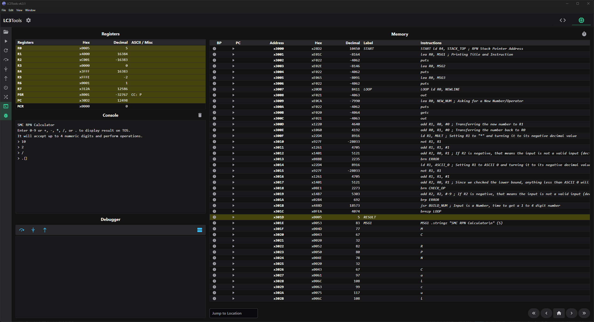
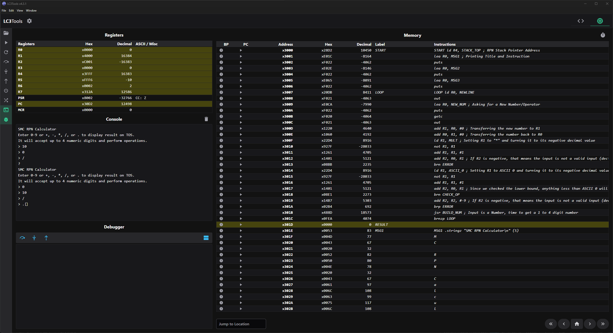

# Division Example
## Example 1



Console:
```
SMC RPN Calculator
Enter 0-9 or +, -, *, /, or . to display result on TOS.
It will accept up to 4 numeric digits and perform operations.
> 10
> 2
> /
> .
```
Result:
```5```


## Example 2



Console:
```
SMC RPN Calculator
Enter 0-9 or +, -, *, /, or . to display result on TOS.
It will accept up to 4 numeric digits and perform operations.
> 10
> 0
> /
?
SMC RPN Calculator
Enter 0-9 or +, -, *, /, or . to display result on TOS.
It will accept up to 4 numeric digits and perform operations.
> 0
> 10
> /
> .
```
Result:
```0```


## Example 3


Console:
```
SMC RPN Calculator
Enter 0-9 or +, -, *, /, or . to display result on TOS.
It will accept up to 4 numeric digits and perform operations.
> 10
> 5
> 10
> -
> /
> .
```
Result:
```-2```